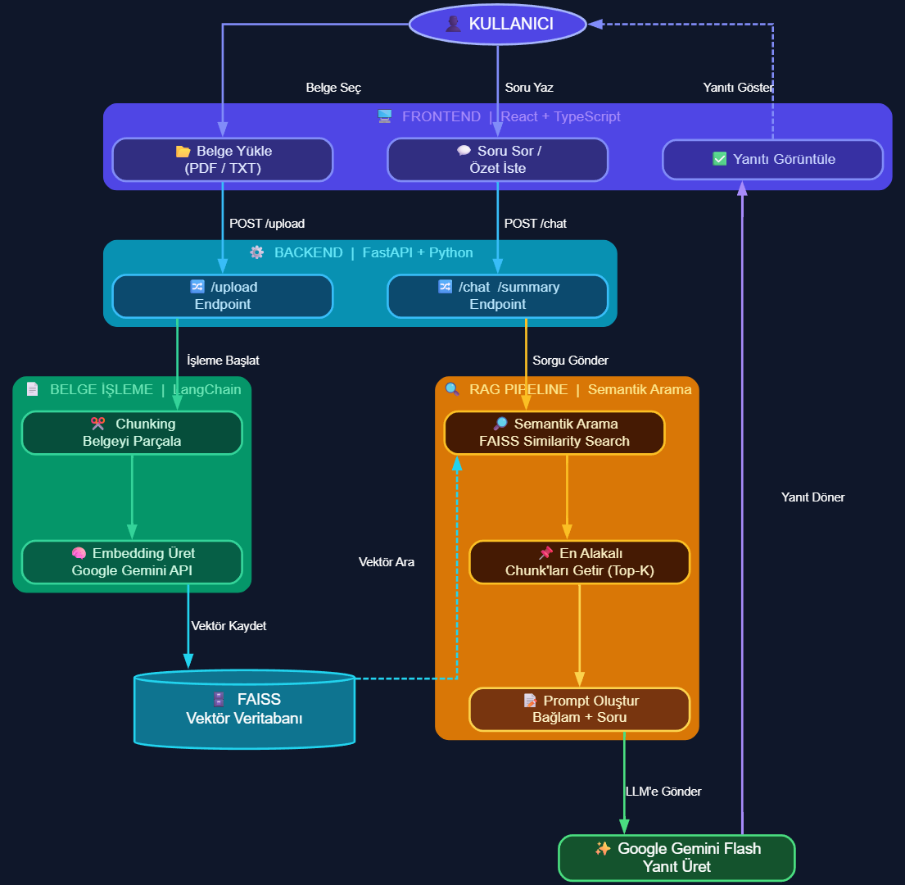
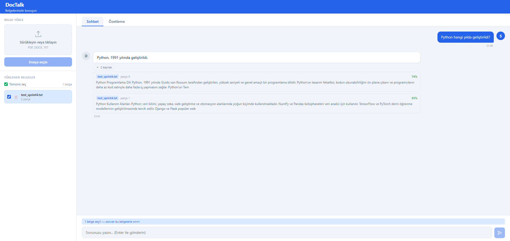
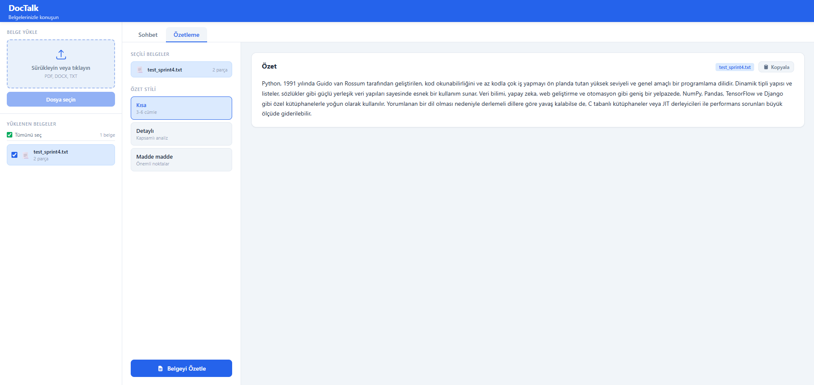
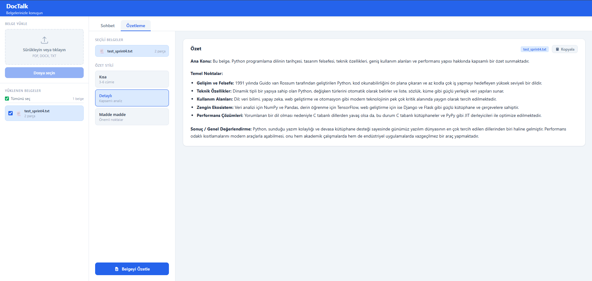
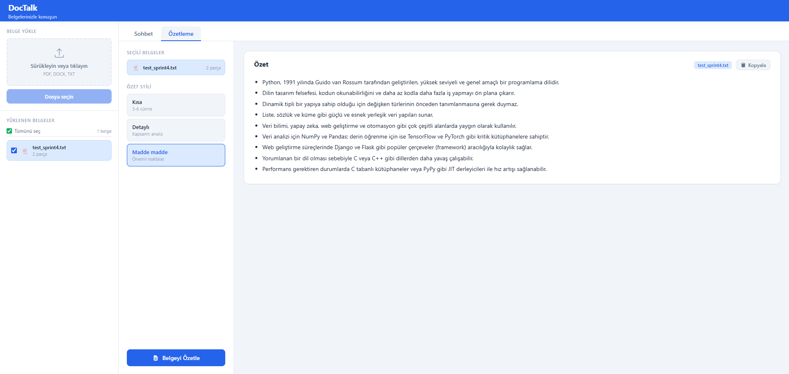

# 📄 DocTalk: AI-Powered Document Assistant

**DocTalk**, modern LLM (Large Language Model) teknolojilerini vektör tabanlı arama ile birleştiren bir **RAG (Retrieval-Augmented Generation)** uygulamasıdır. Kullanıcıların yüklediği PDF ve metin belgelerini analiz eder, bu belgeler içinden semantik arama yapar ve Google Gemini API kullanarak doğal dilde soruları yanıtlar.

---

Proje Tanıtım Videosu: https://youtu.be/bs8mOjw_3xU

## Akış Diyagramı


## 📸 Ekran Görüntüleri

Projenin arayüzüne ve çalışma mantığına dair görselleri aşağıda bulabilirsiniz:

| Ana Sayfa & Chat Ekranı (Dashboard) | Belge Analizi(Kısa Özet) |
| :---: | :---: |
|  |  |

| Belge Analizi(Detaylı Özet) | Belge Analizi(Madde Madde Özet) |
| :---: | :---: |
|  |  |

---

## ✨ Öne Çıkan Özellikler

- **Vektör Tabanlı Semantik Arama:** FAISS kütüphanesi sayesinde dokümanlar içerisinde sadece kelime eşleşmesi değil, anlam odaklı arama yapılır.
- **Akıllı Soru-Cevap:** Google Gemini Flash modeli entegrasyonu ile doküman içeriğine dayalı, bağlamsal ve doğru yanıtlar üretilir.
- **Modern Teknik Mimari:** - **Backend:** FastAPI ile asenkron, hızlı ve ölçeklenebilir API servisleri.
  - **Frontend:** React ve TypeScript ile geliştirilmiş, kullanıcı deneyimi odaklı dinamik arayüz.
- **Gelişmiş Belge İşleme:** Yüklenen belgelerin otomatik olarak parçalanması (chunking) ve embedding işlemlerinin yapılması.

---

## 🛠️ Teknoloji Yığını

| Alan | Kullanılan Teknolojiler |
| :--- | :--- |
| **Backend** | Python, FastAPI, Uvicorn |
| **Frontend** | React, TypeScript, Vite, CSS |
| **AI/ML** | Google Gemini API, LangChain |
| **Vektör DB** | FAISS (Facebook AI Similarity Search) |

---

## ⚙️ Kurulum ve Yapılandırma

**1. Sanal Ortam Oluşturun:**
```bash
python3 -m venv ./.venv
```

**2. Sanal Ortamı Aktif Edin:**
- Mac / Linux:
```bash
source .venv/bin/activate
```
- Windows:
```bash
.venv\Scripts\activate
```

**3. Gerekli Paketleri Yükleyin:**
```bash
pip install -r requirements.txt
```

**4. .env Dosyasını Ayarlayın:**

Projeyi çalıştırmadan önce Google Gemini API anahtarına ihtiyacınız var:
1. [Google AI Studio](https://aistudio.google.com/) adresine gidin.
2. Hesabınıza giriş yapın ve yeni bir "API key" oluşturun.
3. Proje dizininde bulunan `.env.example` dosyasını kopyalayarak yeni bir `.env` dosyası oluşturun.
4. Oluşturduğunuz `.env` dosyasını açın ve `GEMINI_API_KEY` değerine aldığınız API anahtarını yapıştırın:
   ```env
   GEMINI_API_KEY="sizin_api_anahtariniz_buraya"
   ```

**5. Backend'i Başlatın (FastAPI):**

```bash
uvicorn backend.main:app --reload --port 8000
```

**6. Frontend'i Başlatın (React UI):**

```bash
cd frontend
npm install
npm run dev
```

API çalışmaya başladığında aşağıdaki adreslere erişebilirsiniz:
- **Swagger UI:** http://127.0.0.1:8000/docs
- **Upload Endpoint:** `POST http://127.0.0.1:8000/upload`

**7. Vektör Aramasını Test Etme (FAISS):**

Sisteme yüklediğiniz belgeler üzerinde semantic arama yapmak için terminalde `test_search.py` betiğini kullanabilirsiniz:

```bash
# Sanal ortam aktifken çalıştırın:
python test_search.py "Aramak istediğiniz metin veya soru" --k 5
```
*(Not: `--k 5` parametresi en yakın 5 sonucu getirir. Varsayılan değer 3'tür.)*

## 🤝  Katkıda Bulunma
Her türlü geri bildirim, hata raporu veya özellik önerisi için bir issue oluşturabilir ya da pull request gönderebilirsiniz.

## 📄 Lisans
Bu proje MIT Lisansı ile lisanslanmıştır.

👤 Cihan Demir - [GitHub](https://github.com/cdemir7) | [LinkedIn](https://www.linkedin.com/in/demircihan/)
👤 Serkan Yıldız - [GitHub](https://github.com/Serkan0YLDZ) | [LinkedIn](https://www.linkedin.com/in/serkan0yldz/)
